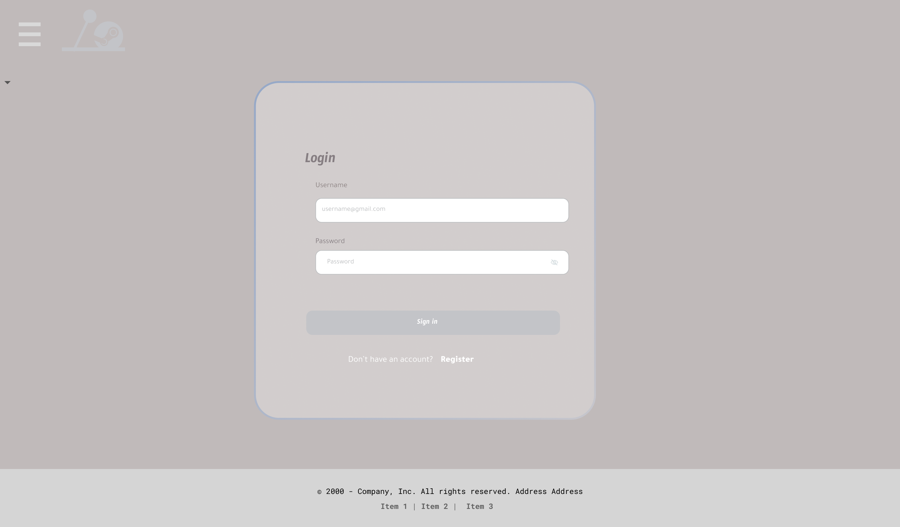
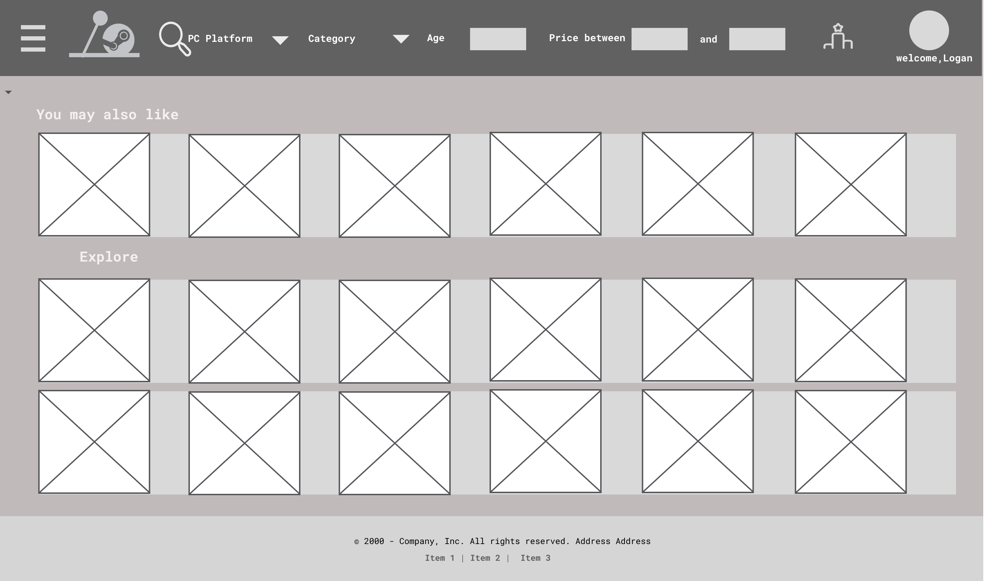
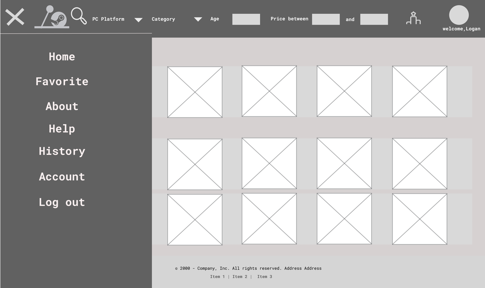
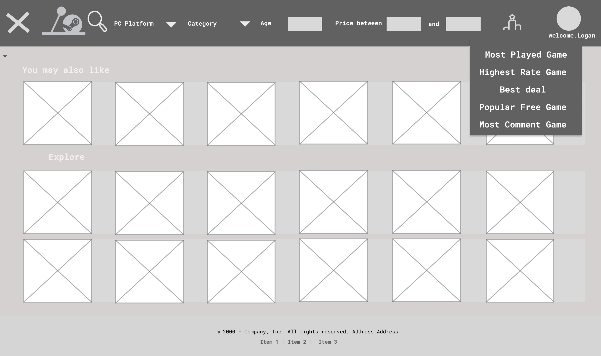
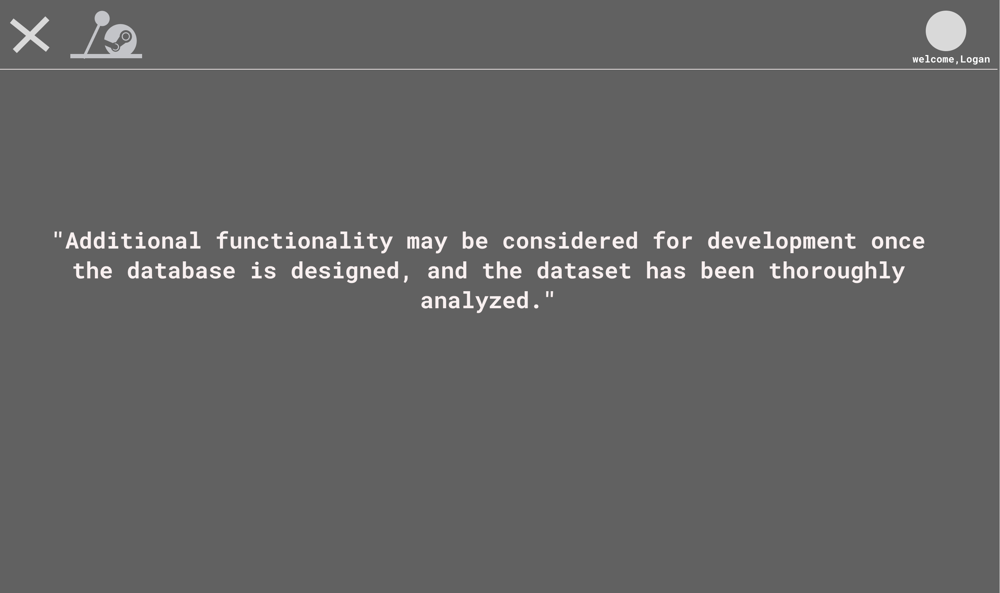

# Project Title: GGSteam

## Project Summary
The goal of this project is to create a gaming community website, catering to Steam users, where they can explore new games, discover gaming deals, and connect with gamers with the same interests. Users will be able to explore the latest games, receive the recommended games, find top games by different categories, the ability to mark their favorite games, track game prices, and provide game reviews. This platform will serve as a hub for gamers to share their experiences, discuss their interests, and build connections with their friends. With a user-friendly interface and a comprehensive set of features, our website aims to enhance the experience for Steam users to find and share games. 

## Description
We plan to build our project based on a Steam game dataset. For the game exploration functionality, we intend to develop three modules. Firstly, there will be a game search feature, allowing users to retrieve information about relevant games using keywords, release dates, game genres, and other criteria through a constructed search engine. The second module will involve generating top lists for various game categories, such as rankings for free games, using the dataset. The third module will focus on a game recommendation system, utilizing user browsing history, favorite game selections, and other user-specific data to suggest games tailored to individual preferences. Furthermore, concerning user functionalities on the website, we are planning to construct a database to store user login information, browsing histories, user reviews, and friend connections.

This project aims to address four key issues for gamers:
The first one is that many gamers struggle to find games that match their preferences within the vast gaming library. This project will provide personalized game recommendations, making it easier for players to discover new titles. Next, game prices can fluctuate significantly, leading players to miss out on discounts and special offers. This project will track game price changes, ensuring users can seize the best deals promptly. Also, gamers often seek to connect with others who share their interests and share their gaming experiences. This project will offer a platform for building social connections, exchanging insights, and reviewing games. Last but not least, game releases and updates occur frequently, making it challenging for users to keep up with all the latest information. This project will provide users with up-to-date game notifications, ensuring they stay informed.

## Usefulness
By offering users and players a variety of improved functionalities that simplify the game-discovery process, our project stands out. Our platform makes sure users can easily identify games that truly resonate with their tastes without feeling overwhelmed by a sea of options by utilizing advanced search options combined with intricate filters, curated game listings, and recommendations related to individual preferences and past behaviors.

Although similar features are provided by websites like Metacritic and Steam's native store, our application stands out due to its focus on customization. In addition to the conventional game recommendation systems, we offer a social environment that enables users to decide which games they can play with friends in a group setting, encouraging both individual exploration and group enjoyment.

## Realness
In our project, we are going to use the dataset provided in the Project Track 1 Datasets. The dataset comes from [data.world](https://data.world/craigkelly/steam-game-data). It is a combination of data from publicly available Steam API's and steamspy.com. It contains over 13,000 rows of data and it has 78 columns of attributes. It covers most of the attributes we are going to use in our project, such as Game name, Price, Categories, Support Platforms, Genres, Reviews, etc. 

We will maximize our utilization of the attributes but not limited to the attributes mentioned above to build a Steam Game Explorer to provide our users with a powerful game query system. Meanwhile, we will create tables to store personalized data based on users’ behavior of browsing the website combined with game attributes to establish a recommendation system to help users find the games they might be interested in. Since the dataset consists of real data from the steam data, therefore, our project will provide an extraordinary experience when users are using our website.

## Functionality
### Low-fidelity UI Mockup
> Login Page

> Home Page

> Burger Menu

> Rank Feature

> About Page

### Project Work Distribution
Our project is organized into four distinct sections: Data Processing, Database Design, Frontend UI Implementation, and Backend Implementation. Initially, our team was divided into two groups, with two members focusing on UI implementation and two on data processing and database design. We diligently processed and prepared the data, designed an efficient database schema, and created a user-friendly front-end interface. As the project evolved, we seamlessly transitioned to backend development, where we integrated the processed data to provide valuable functionalities. The following highlights our distribution.
- *Shenghao*: responsible for Data processing, helping with db design as needed. Responsible for DB design testing to make sure all SQL commands will return the correct result as anticipation. Help with deployed backend related to db.
- *Tianhao*: responsible for DB design, including query, trigger, and stored procedure. Help with data processing as needed. Help with the DB design testing as needed. Help with deployed backend related to db.
- *Jialu*: Responsible for UI design, focusing on the style's design, checking Websize compatibility, and helping with frame implementation as needed. Responsible for Backend frame implementation. Help with web testing as needed.
- *Lingge*: Responsible for UI design and frame implementation, helping with style choice as needed. Help with backend implementation, work on logic structure with DB, and be responsible for web testing.
