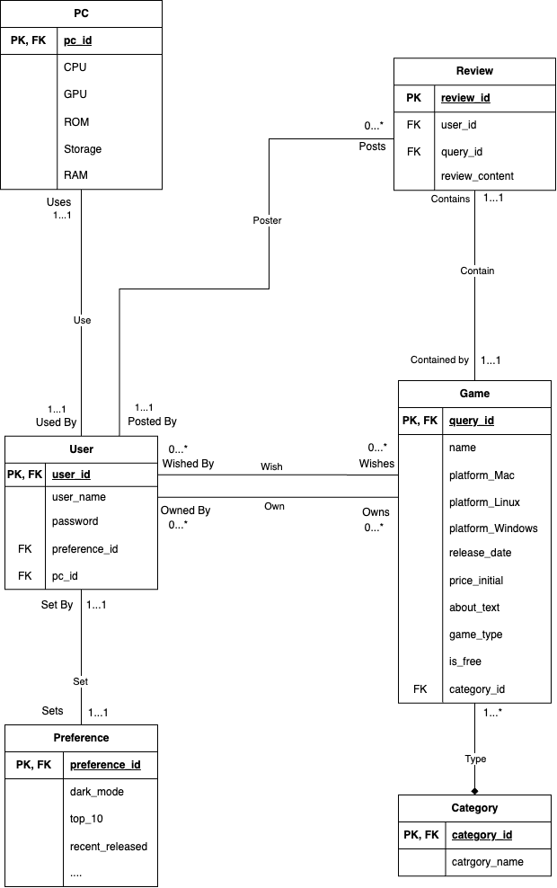

# Database Design

## UML Diagram



## Description
The Game entity contains information from the Steam Games dataset. The entity has a unique Query_id and all the required information about the game like Name, release_date, Is_free, Platform, Price Initial,Price Final, AboutText, game type and category_id. This information can help us display the games to search results and filter the game during recommendation. There are 5 relationships related to Game Entity:
The relationship between the Game entity and Review entity is Many to One, as a Game can have many reviews but a review can only be for one game.
The relationship between Game and Category is Many to Many as we assume that one game can have many categories and one category can have many games.
The relationship between Game and PC is One to One that a game needs one recommended PC, and a recommend PC corresponding to one Game.
There are two relationships between User and Game and both are Many to Many. The first relationship is a user can own many games and one game can be owned by many users. The second relationship is a user can wishlist many games and one game can be added to wishlist by many users.

The Category entity contains information about all the categories the game belongs to. The only relationship for Category is between Game and Category. The relationship between Game and Category is Many to Many as we assume that one game can have many categories and one category can have many games.

The User entity contains information about users for our website such as a unique Userid, Username, Password, pc_id and preference_id. There are several relationships for User Entity:
The relationship between User and PC is One to One as we assume that a user will have at most one computer and a computer information can only belong to one user. 
The relationship between Preference and User is One to One as we assume that a user will have only one preference setting and one preference setting can only belong to one user.
The relationship between User and Review is One to Many as we assume that a user can post many reviews and one review only belongs to one user.
There are two relationships between User and Game and both are Many to Many. The first relationship is a user can own many games and one game can be owned by many users. The second relationship is a user can wishlist many games and one game can be added to wishlist by many users.

The Preference entity contains information about the users’ settings for the web page and they can modify the preferences any time while using the website. The preference includes dark_mode, showTop_10 and showrecent_released game. There is only one relationship for Preference Entity. The relationship between Preference and User is One to One as we assume that a user will have only one preference setting and one preference setting can only belong to one user.

The PC entity contains information about users' computer information entered by the user the first time they start to use our website. The information includes Pc_id, CPU, GPU, ROM, Storage, RAM. This entity will help us ensure compatibility for the games searched and recommended to them. The relationship between User and PC is One to One as we assume that a user will have at most one computer and a computer information can only belong to one user. The relationship between Game and PC is One to One that a game needs one recommended PC, and a recommend PC corresponding to one Game.

The Review entity contains information from the Steam Games dataset. The entity includes unique reviewid, userid, query_id and review_content. There are two relationships for Review Entity. First, The relationship between the Game entity and Review entity is Many to One, as a Game can have many reviews but a review can only be for one game. The other,The relationship between User and Review is One to Many as we assume that a user can post many reviews and one review only belongs to one user.

## Normalization

For the sake of simplicity, all attributes that are only related to one key are summarized as `xxx_attr`

### Apply 3NF

$pc\\_id \to pc\\_attr$; \
$user\\_id \to user\\_attr, \underline{pc\\_id}, \underline{preference\\_id}$; \
$preference\\_id \to preference\\_attr$; \
$review\\_id \to review\\_attr$; \
$query\\_id \to game\\_attr, \underline{category\\_id}, \underline{pc\\_id}$; \
$category\\_id \to category\\_attr$; \
$user\\_id, query\\_id \to \underline{review\\_id}$

The relationship is already in 3NF form, because all the LHS is the superkey of RHS, or the RHS is part of a key (underlined).

The reason of using 3NF is that it has dependency preservation unlike BNCF which does not. 3NF can also avoid information loss.


## Relational Schema

```mysql
PC(
    pc_id   INT         [PK], 
    CPU     VARCHAR(50), 
    GPU     VARCHAR(50), 
    ROM     VARCHAR(50), 
    Storage VARCHAR(50), 
    RAM     VARCHAR(50)
);
```
```mysql
User(
    user_id         INT         [PK], 
    user_name       VARCHAR(30), 
    password        VARCHAR(30), 
    preference_id   INT         [FK to Preference.preference_id], 
    pc_id           INT         [FK to PC.pc_id]
);
```

```mysql
Preference(
    preference_id   INT     [PK], 
    dark_mode       BOOLEAN, 
    top_10          BOOLEAN, 
    recent_released BOOLEAN, 
    most_commented  BOOLEAN, 
    most_popular    BOOLEAN
);
```

```mysql
Review(
    review_id       INT     [PK], 
    user_id         INT     [FK to User.user_id], 
    query_id        INT     [FK to Game.query_id], 
    review_content  VARCHAR(1000)
);
```

```mysql
Game(
    query_id            INT             [PK], 
    name                VARCHAR(50), 
    platform_Mac        BOOLEAN, 
    platform_Windows    BOOLEAN, 
    platform_Linux      BOOLEAN, 
    released_date       VARCHAR(30), 
    price_initial       DECIMAL(5, 2), 
    about_text          VARCHAR(1000), 
    game_type           BOOLEAN, 
    is_free             BOOLEAN, 
    category_id         INT             [FK to Category.category_id],
    pc_id               INT             [FK to PC.pc_id]
);
```

```mysql
Category(
    category_id     INT         [PK], 
    category_name   VARCHAR(30) [FK to table.column]
);
```

```mysql
GameOwnedUser(
    user_id     INT [FK to User.user_id]  [PK], 
    query_id    INT [FK to Game.query_id] [PK]
);
```

```mysql
UserWishlist(
    user_id     INT [FK to User.user_id]  [PK], 
    query_id    INT [FK to Game.query_id] [PK]
);
```

(we might have more attribute in Reference, and Game)
