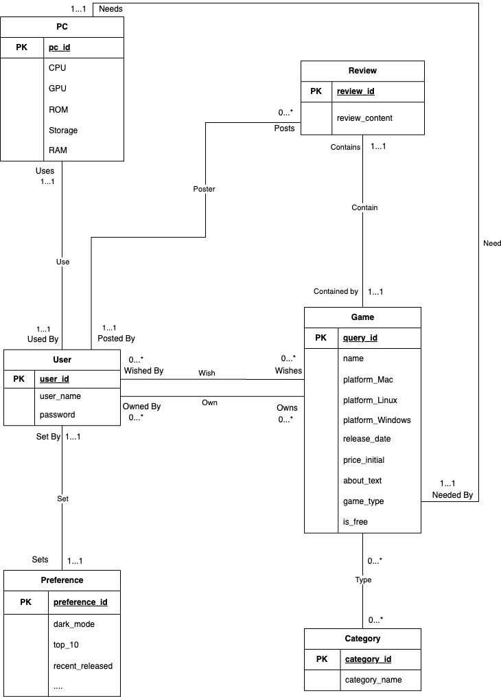

# Database Design

## UML Diagram

## Description

## Normalization

For the sake of simplicity, all attributes that are only related to one key are summarized as `xxx_attr`

$R(pc\\_id, pc\\_attr, user\\_id, user\\_attr, preference\\_id, preference\\_attr, review\\_id, review\\_attr, query\\_id, game\\_attr, category\\_id, category\\_attr)$

### FDs

$pc\\_id \to pc\\_attr$; \
$user\\_id \to user\\_attr, pc\\_id, preference\\_id$; \
$preference\\_id \to preference\\_attr$; \
$review\\_id \to review\\_attr$; \
$query\\_id \to game\\_attr, category\\_id$; \
$category\\_id \to category\\_attr$; \
$user\\_id, query\\_id \to review\\_id$

## Relational Schema

`PC(pc_id:INT[PK], CPU:VARCHAR(50), GPU:VARCHAR(50), ROM:VARCHAR(50), Storage:VARCHAR(50), RAM:VARCHAR(50))`;

`User(user_id:INT[PK], user_name:VARCHAR(30), password:VARCHAR(30), preference_id:INT [FK to Preference.preference_id], pc_id:INT[FK to PC.pc_id])`;

`Preference(preference_id:INT[PK], dark_mode:BOOLEAN, top_10:BOOLEAN, recent_released:BOOLEAN, most_commented:BOOLEAN, most_popular:BOOLEAN)`;
`Review(review_id:INT[PK], user_id:INT[FK to User.user_id], query_id:INT[FK to Game.query_id], review_content:VARCHAR(1000))`;

`Game(query_id:INT[PK], name:VARCHAR(50), platform_Mac:BOOLEAN, platform_Windows:BOOLEAN, platform_Linux:BOOLEAN, released_date:VARCHAR(30), price_initial:DECIMAL(5, 2), about_text:VARCHAR(1000),game_type:Boolean, is_free:Boolean, category_id:INT[FK to Category.category_id])`;

`Category(category_id:INT[PK], category_name:VARCHAR(30)[FK to table.column])`;

`GameOwnedUser((user_id:INT[FK to User.user_id], query_id:INT[FK to Game.query_id])[PK])`;

`UserWishlist((user_id:INT[FK to User.user_id], query_id:INT[FK to Game.query_id])[PK]);`

(we might have more attribute in Reference, and Game)
