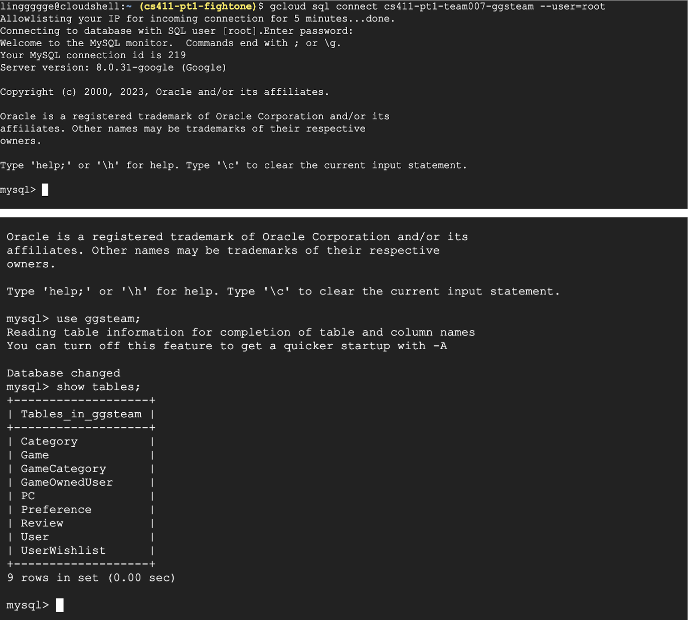
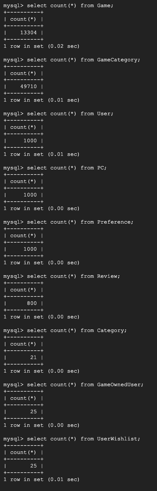
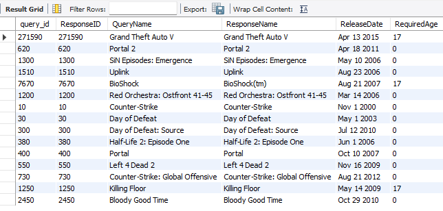
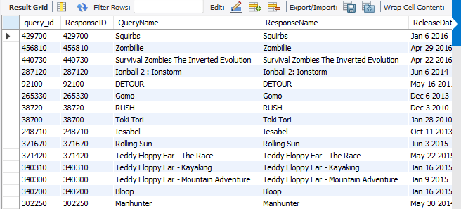

# GCP connection



# DDL

```mysql
-- PC Table
CREATE TABLE PC (
    pc_id     INT PRIMARY KEY,
    CPU       VARCHAR(50),
    GPU       VARCHAR(50),
    ROM       INT,
    Storage   INT,
    RAM       INT,
    Score     INT
);

-- Preference Table
CREATE TABLE Preference (
    preference_id   INT PRIMARY KEY,
    dark_mode       BOOLEAN,
    top_10          BOOLEAN,
    recent_released BOOLEAN,
    most_commented  BOOLEAN,
    most_popular    BOOLEAN
);

-- User Table
CREATE TABLE User (
    user_id         INT PRIMARY KEY,
    user_name       VARCHAR(30),
    password        VARCHAR(30),
    preference_id   INT,
    pc_id           INT,
    FOREIGN KEY (preference_id) REFERENCES Preference(preference_id),
    FOREIGN KEY (pc_id) REFERENCES PC(pc_id)
);

-- Game Table
CREATE TABLE Game (
    query_id                   INT PRIMARY KEY,
    ResponseID                 INT,
    QueryName                  TEXT,
    ResponseName               TEXT,
    ReleaseDate                TEXT,
    RequiredAge                INT,
    DemoCount                  TEXT,
    DeveloperCount             TEXT,
    DLCCount                   TEXT,
    Metacritic                 INT,
    MovieCount                 TEXT,
    PackageCount               TEXT,
    RecommendationCount        INT,
    PublisherCount             TEXT,
    ScreenshotCount            TEXT,
    SteamSpyOwners             INT,
    SteamSpyOwnersVariance     INT,
    SteamSpyPlayersEstimate    INT,
    SteamSpyPlayersVariance    INT,
    AchievementCount           INT,
    AchievementHighlightedCount INT,
    ControllerSupport          BOOLEAN,
    IsFree                     BOOLEAN,
    FreeVerAvail               BOOLEAN,
    PurchaseAvail              BOOLEAN,
    SubscriptionAvail          BOOLEAN,
    PlatformWindows            BOOLEAN,
    PlatformLinux              BOOLEAN,
    PlatformMac                BOOLEAN,
    PriceCurrency              TEXT,
    PriceInitial               FLOAT,
    PriceFinal                 FLOAT,
    SupportEmail               TEXT,
    SupportURL                 TEXT,
    AboutText                  TEXT,
    Background                 TEXT,
    ShortDescrip               TEXT,
    DetailedDescrip            TEXT,
    DRMNotice                  TEXT,
    ExtUserAcctNotice          TEXT,
    HeaderImage                TEXT,
    LegalNotice                TEXT,
    SupportedLanguages         TEXT,
    Website                    TEXT,
    -- Foreign Key references
    pc_id                      INT,
    FOREIGN KEY (pc_id) REFERENCES PC(pc_id)
);

-- Review Table
CREATE TABLE Review (
    review_id       INT PRIMARY KEY,
    user_id         INT,
    query_id        INT,
    review_content  VARCHAR(1000),
    FOREIGN KEY (user_id) REFERENCES User(user_id)
    ON DELETE CASCADE,
    FOREIGN KEY (query_id) REFERENCES Game(query_id)
    ON DELETE CASCADE
);

-- Category Table
CREATE TABLE Category (
    category_id     INT PRIMARY KEY,
    category_name   VARCHAR(30)
);

-- GameOwnedUser Table (many-to-many relationship)
CREATE TABLE GameOwnedUser (
    user_id     INT,
    query_id    INT,
    PRIMARY KEY (user_id, query_id),
    FOREIGN KEY (user_id) REFERENCES User(user_id)
    ON DELETE CASCADE,
    FOREIGN KEY (query_id) REFERENCES Game(query_id)
    ON DELETE CASCADE
);

-- UserWishlist Table (many-to-many relationship)
CREATE TABLE UserWishlist (
    user_id     INT,
    query_id    INT,
    PRIMARY KEY (user_id, query_id),
    FOREIGN KEY (user_id) REFERENCES User(user_id)
    ON DELETE CASCADE,
    FOREIGN KEY (query_id) REFERENCES Game(query_id)
    ON DELETE CASCADE
);

-- GameCategory Table (many-to-many relationship)
CREATE TABLE GameCategory (
    category_id     INT,
    query_id        INT,
    PRIMARY KEY (category_id, query_id),
    FOREIGN KEY (category_id) REFERENCES Category(category_id)
    ON DELETE CASCADE,
    FOREIGN KEY (query_id) REFERENCES Game(query_id)
    ON DELETE CASCADE
);

```
# Tables with count


# Advanced queries 

1. Most Owned Paid 15 Games with High Score
```mysql
SELECT * 
FROM Game g LEFT JOIN (
    SELECT o.query_id, count(o.user_id) as num_player
    FROM GameOwnedUser o
    Group by o.query_id
) o1 ON g.query_id = o1.query_id
WHERE g.Metacritic > 70 and IsFree = False
ORDER BY o1.num_player
LIMIT 15;
```


2. Top 15 Deal SinglePlayer Games
```mysql
SELECT *
FROM Game g1
WHERE g1. PriceInitial > 0 and g1.query_id IN (
    SELECT gc.query_id
    FROM Category c NATURAL JOIN GameCategory gc
    WHERE c.category_name = "CategorySinglePlayer"
) 
ORDER BY (g1.PriceFinal / g1.PriceInitial) ASC
LIMIT 15;
```


# Indexing Analysis

1. Most Owned Paid 15 Games with High Score
    1. Default Index (0.031)
        ```
        -> Limit: 15 row(s)  (cost=15.35 rows=0) (actual time=0.289..0.416 rows=15 loops=1)
            -> Nested loop inner join  (cost=15.35 rows=0) (actual time=0.288..0.414 rows=15 loops=1)
                -> Sort: o1.num_player DESC  (cost=2.60..2.60 rows=0) (actual time=0.210..0.212 rows=20 loops=1)
                    -> Table scan on o1  (cost=2.50..2.50 rows=0) (actual time=0.189..0.192 rows=22 loops=1)
                        -> Materialize  (cost=0.00..0.00 rows=0) (actual time=0.189..0.189 rows=22 loops=1)
                            -> Table scan on <temporary>  (actual time=0.168..0.171 rows=22 loops=1)
                                -> Aggregate using temporary table  (actual time=0.166..0.166 rows=22 loops=1)
                                    -> Covering index scan on o using PRIMARY  (cost=3.65 rows=34) (actual time=0.073..0.081 rows=35 loops=1)
                -> Filter: ((g.IsFree = false) and (g.Metacritic > 70))  (cost=0.38 rows=0.05) (actual time=0.010..0.010 rows=1 loops=20)
                    -> Single-row index lookup on g using PRIMARY (query_id=o1.query_id)  (cost=0.38 rows=1) (actual time=0.009..0.009 rows=1 loops=20)
        ```
    2. CREATE INDEX on Game.MetaCritics (attempt to improve filter)
        ```
        -> Limit: 15 row(s)  (cost=15.35 rows=0) (actual time=0.126..0.236 rows=15 loops=1)
            -> Nested loop inner join  (cost=15.35 rows=0) (actual time=0.125..0.234 rows=15 loops=1)
                -> Sort: o1.num_player DESC  (cost=2.60..2.60 rows=0) (actual time=0.075..0.077 rows=20 loops=1)
                    -> Table scan on o1  (cost=2.50..2.50 rows=0) (actual time=0.060..0.062 rows=22 loops=1)
                        -> Materialize  (cost=0.00..0.00 rows=0) (actual time=0.059..0.059 rows=22 loops=1)
                            -> Table scan on <temporary>  (actual time=0.045..0.047 rows=22 loops=1)
                                -> Aggregate using temporary table  (actual time=0.043..0.043 rows=22 loops=1)
                                    -> Covering index scan on o using PRIMARY  (cost=3.65 rows=34) (actual time=0.015..0.021 rows=35 loops=1)
                -> Filter: ((g.IsFree = false) and (g.Metacritic > 70))  (cost=0.38 rows=0.05) (actual time=0.008..0.008 rows=1 loops=20)
                    -> Single-row index lookup on g using PRIMARY (query_id=o1.query_id)  (cost=0.38 rows=1) (actual time=0.007..0.007 rows=1 loops=20)
        ```
        Does not change at all
    3. CREATE INDEX on Game.IsFree (complement with Game.MetaCritics to improve filer)
        ```
        -> Limit: 15 row(s)  (cost=15.35 rows=0) (actual time=0.113..0.258 rows=15 loops=1)
            -> Nested loop inner join  (cost=15.35 rows=0) (actual time=0.112..0.257 rows=15 loops=1)
                -> Sort: o1.num_player DESC  (cost=2.60..2.60 rows=0) (actual time=0.079..0.081 rows=20 loops=1)
                    -> Table scan on o1  (cost=2.50..2.50 rows=0) (actual time=0.063..0.066 rows=22 loops=1)
                        -> Materialize  (cost=0.00..0.00 rows=0) (actual time=0.063..0.063 rows=22 loops=1)
                            -> Table scan on <temporary>  (actual time=0.049..0.051 rows=22 loops=1)
                                -> Aggregate using temporary table  (actual time=0.047..0.047 rows=22 loops=1)
                                    -> Covering index scan on o using PRIMARY  (cost=3.65 rows=34) (actual time=0.021..0.028 rows=35 loops=1)
                -> Filter: ((g.IsFree = false) and (g.Metacritic > 70))  (cost=0.38 rows=0.3) (actual time=0.008..0.009 rows=1 loops=20)
                    -> Single-row index lookup on g using PRIMARY (query_id=o1.query_id)  (cost=0.38 rows=1) (actual time=0.008..0.008 rows=1 loops=20)
        ```
        No change either
    5. CREATE INDEX on GameOwnedUser.query (attempt to improve group and join performance)
        ```
        -> Limit: 15 row(s)  (cost=50.22 rows=11) (actual time=0.137..0.314 rows=15 loops=1)
            -> Nested loop inner join  (cost=50.22 rows=11) (actual time=0.136..0.312 rows=15 loops=1)
                -> Sort: o1.num_player DESC  (cost=34.07..34.07 rows=34) (actual time=0.093..0.095 rows=22 loops=1)
                    -> Table scan on o1  (cost=10.54..13.38 rows=34) (actual time=0.073..0.076 rows=22 loops=1)
                        -> Materialize  (cost=10.45..10.45 rows=34) (actual time=0.071..0.071 rows=22 loops=1)
                            -> Group aggregate: count(o.user_id)  (cost=7.05 rows=34) (actual time=0.040..0.051 rows=22 loops=1)
                                -> Covering index scan on o using query_id  (cost=3.65 rows=34) (actual time=0.034..0.041 rows=35 loops=1)
                -> Filter: ((g.IsFree = false) and (g.Metacritic > 70))  (cost=0.38 rows=0.3) (actual time=0.010..0.010 rows=1 loops=22)
                    -> Single-row index lookup on g using PRIMARY (query_id=o1.query_id)  (cost=0.38 rows=1) (actual time=0.009..0.009 rows=1 loops=22)
        ```
        It performed differently after the `Table scan`, however, the latter one does not show the cost, by using the `Visual Explain` feature and approximating the actual time, they have similar performance. I think that might be because the table is limited to 15, so it is really small to predict the difference. Also, it used `query_id` for covering index scan instead of `PRIMARY` which consists of `query_id` and `user_id`, but I don't think there is a different between those two.

4. Top 15 Deal SinglePlayer Games
    1. Default Index
        ```
        -> Limit: 15 row(s)  (cost=5104633.65 rows=15) (actual time=331.367..331.477 rows=15 loops=1)
            -> Nested loop inner join  (cost=5104633.65 rows=51012700) (actual time=331.365..331.474 rows=15 loops=1)
                -> Sort: (g1.PriceFinal / g1.PriceInitial)  (cost=3042.52 rows=9635) (actual time=324.790..324.885 rows=15 loops=1)
                    -> Filter: (g1.PriceInitial > 0)  (cost=3042.52 rows=9635) (actual time=0.045..49.788 rows=10686 loops=1)
                        -> Table scan on g1  (cost=3042.52 rows=9635) (actual time=0.042..48.174 rows=13304 loops=1)
                -> Single-row index lookup on <subquery2> using <auto_distinct_key> (query_id=g1.query_id)  (actual time=0.439..0.439 rows=1 loops=15)
                    -> Materialize with deduplication  (cost=1064.36..1064.36 rows=5295) (actual time=6.564..6.564 rows=11637 loops=1)
                        -> Nested loop inner join  (cost=534.91 rows=5295) (actual time=0.080..4.120 rows=11637 loops=1)
                            -> Filter: (c.category_name = 'CategorySinglePlayer')  (cost=2.35 rows=2) (actual time=0.043..0.060 rows=1 loops=1)
                                -> Table scan on c  (cost=2.35 rows=21) (actual time=0.036..0.045 rows=21 loops=1)
                            -> Covering index lookup on gc using PRIMARY (category_id=c.category_id)  (cost=121.54 rows=2521) (actual time=0.035..3.054 rows=11637 loops=1)
        ```
    2. CREATE INDEX on Game.PriceInitial to reduce the filter time
        ```
        -> Limit: 15 row(s)  (actual time=153.016..153.091 rows=15 loops=1)
            -> Sort: (g1.PriceFinal / g1.PriceInitial), limit input to 15 row(s) per chunk  (actual time=153.014..153.088 rows=15 loops=1)
                -> Stream results  (cost=75434.25 rows=5295) (actual time=7.823..119.160 rows=9894 loops=1)
                    -> Nested loop inner join  (cost=75434.25 rows=5295) (actual time=7.796..74.431 rows=9894 loops=1)
                        -> Table scan on <subquery2>  (cost=1064.37..1133.03 rows=5295) (actual time=7.744..10.278 rows=11637 loops=1)
                            -> Materialize with deduplication  (cost=1064.36..1064.36 rows=5295) (actual time=7.741..7.741 rows=11637 loops=1)
                                -> Nested loop inner join  (cost=534.91 rows=5295) (actual time=0.070..4.789 rows=11637 loops=1)
                                    -> Filter: (c.category_name = 'CategorySinglePlayer')  (cost=2.35 rows=2) (actual time=0.035..0.061 rows=1 loops=1)
                                        -> Table scan on c  (cost=2.35 rows=21) (actual time=0.031..0.045 rows=21 loops=1)
                                    -> Covering index lookup on gc using PRIMARY (category_id=c.category_id)  (cost=121.54 rows=2521) (actual time=0.033..3.814 rows=11637 loops=1)
                        -> Filter: (g1.PriceInitial > 0)  (cost=73771.87 rows=1) (actual time=0.005..0.005 rows=1 loops=11637)
                            -> Single-row index lookup on g1 using PRIMARY (query_id=`<subquery2>`.query_id)  (cost=73771.87 rows=1) (actual time=0.005..0.005 rows=1 loops=11637)
        ```
        It greatly reduced the time from 0.375 sec to 0.172 sec. By indexing on price, it changes the order of execution, since the filter reduces a great amount of datasets, so every operation after it is largely reduced in time.
    3.  CREATE INDEX on GameCategory.category_name to optimize the where clause
        ```
        -> Limit: 15 row(s)  (actual time=142.552..142.640 rows=15 loops=1)
        -> Sort: (g1.PriceFinal / g1.PriceInitial), limit input to 15 row(s) per chunk  (actual time=142.549..142.636 rows=15 loops=1)
            -> Stream results  (cost=1451.18 rows=840) (actual time=0.079..114.103 rows=9894 loops=1)
                -> Remove duplicate g1 rows using temporary table (weedout)  (cost=1451.18 rows=840) (actual time=0.067..74.046 rows=9894 loops=1)
                    -> Nested loop inner join  (cost=1451.18 rows=840) (actual time=0.063..65.717 rows=9894 loops=1)
                        -> Nested loop inner join  (cost=253.95 rows=2521) (actual time=0.037..5.106 rows=11637 loops=1)
                            -> Covering index lookup on c using name (category_name='CategorySinglePlayer')  (cost=0.35 rows=1) (actual time=0.011..0.020 rows=1 loops=1)
                            -> Covering index lookup on gc using PRIMARY (category_id=c.category_id)  (cost=253.60 rows=2521) (actual time=0.025..4.208 rows=11637 loops=1)
                        -> Filter: (g1.PriceInitial > 0)  (cost=0.37 rows=0.3) (actual time=0.005..0.005 rows=1 loops=11637)
                            -> Single-row index lookup on g1 using PRIMARY (query_id=gc.query_id)  (cost=0.37 rows=1) (actual time=0.005..0.005 rows=1 loops=11637)
        ```
        Setting it reduced all full table scans and achieved an optimized solution.
   4.  CREATE INDEX on Game.PriceFinal to optimize order
        ```
        -> Limit: 15 row(s)  (actual time=147.538..147.727 rows=15 loops=1)
        -> Sort: (g1.PriceFinal / g1.PriceInitial), limit input to 15 row(s) per chunk  (actual time=147.536..147.724 rows=15 loops=1)
            -> Stream results  (cost=1451.18 rows=840) (actual time=0.094..115.887 rows=9894 loops=1)
                -> Remove duplicate g1 rows using temporary table (weedout)  (cost=1451.18 rows=840) (actual time=0.081..74.156 rows=9894 loops=1)
                    -> Nested loop inner join  (cost=1451.18 rows=840) (actual time=0.077..65.311 rows=9894 loops=1)
                        -> Nested loop inner join  (cost=253.95 rows=2521) (actual time=0.051..5.712 rows=11637 loops=1)
                            -> Covering index lookup on c using name (category_name='CategorySinglePlayer')  (cost=0.35 rows=1) (actual time=0.019..0.027 rows=1 loops=1)
                            -> Covering index lookup on gc using PRIMARY (category_id=c.category_id)  (cost=253.60 rows=2521) (actual time=0.031..4.845 rows=11637 loops=1)
                        -> Filter: (g1.PriceInitial > 0)  (cost=0.37 rows=0.3) (actual time=0.005..0.005 rows=1 loops=11637)
                            -> Single-row index lookup on g1 using PRIMARY (query_id=gc.query_id)  (cost=0.37 rows=1) (actual time=0.005..0.005 rows=1 loops=11637)
        ```
        Does not work, the index does not work for ordering (maybe for ordering with the calculation)
3. Final Index Design
    1. Game.InitialPrice - When buying games, price is an important aspect to be considered, so there will be a lot of queries to use `InitialPrice` as the filter, and setting it as the index could improve those performances.
    2. GameCategory.category_name - Same as price, people often search for games in the category they want to play, so it is often used in where/group clauses, so indexing it could optimize performance.
    3. Other attributes I tested above are useless in the queries above, so I am not adopting those as indexes. Some might be because of the size of the table, which is open for testing later.
